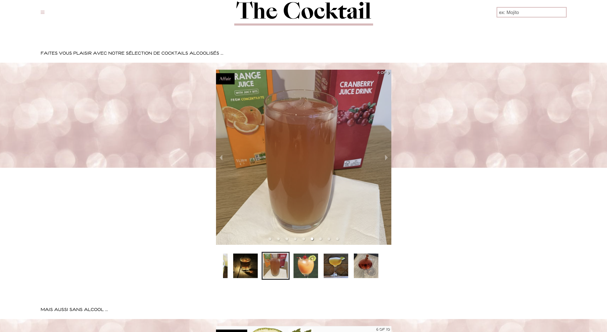

 
 
<h1>The Cocktail (Front & Back : Next.js / Deployed on Vercel)</h1>
 

Fullstack project on Next.js based on the <a href="https://www.thecocktaildb.com/api.php">The Cocktail DB API</a>.

<h3>

You can find the <a href="https://thecocktail-nextjs.vercel.app/">Live Demo here !</a>

</h3>
 
 

 
<h2 style="color:#ddb9ba" >Features</h2>
<ul>
  <li>Get random cocktails with their recipe</li>
  
  <li>Search cocktails and get suggestions</li>
  
  <li>Search cocktails by ingredients</li>
  
  <li>Add cocktails into favorites</li>
 
  </ul>

 
<h2 style="color:#ddb9ba" >Next features</h2>
<ul>
  <li>Create your own cocktails and share them with all other cocktails</li>
  
  <li>Offline mode</li>
 
  </ul>

 
<h2 style="color:#ddb9ba">Packages used</h2>

<ul>
  <li>next</li>
  <li>axios</li>
  <li>react</li>
  <li>redux</li>
  <li>font-awesome</li>
<li>react-responsie-carousel</li>

  </ul>

 
<h2 style="color:#ddb9ba">Install</h2>

Just run <code>yarn</code> in your console to install all dependencies and <code>yarn start</code> to launch.

 
